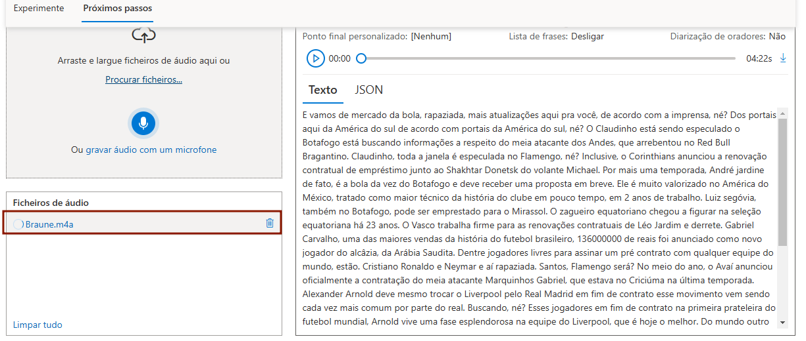
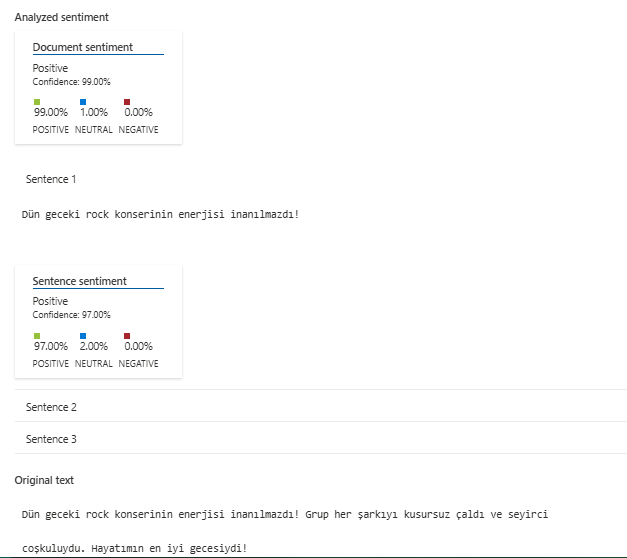
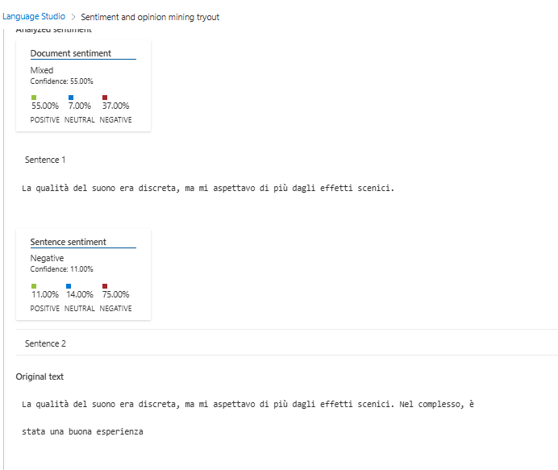
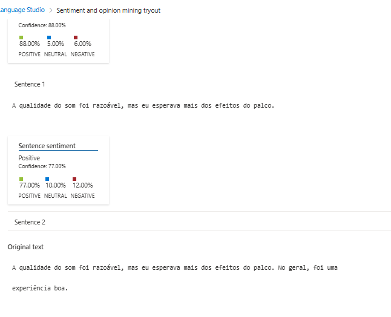

**Descrição**
O **Laboratório de Serviços de Linguagem Natural do Microsoft Azure** é um ambiente inovador e altamente escalável projetado para explorar, desenvolver e implementar soluções baseadas em linguagem natural. Este laboratório aproveita a plataforma robusta do Azure para oferecer serviços avançados que transformam textos não estruturados em insights valiosos para empresas e desenvolvedores

**Serviço de conversão de voz em texto**

O serviço funcionou muito bem, convertendo com boa precisão o aúdio, inclusive pontuando o texto.

**Ferramenta de Análise de sentimentos **

todos os comentários estão em um contexto de show de rock, com opniões diversas em vários idiomas
**Comentário em turco**

Foi detectado como avaliação positiva

**Comentário em Italiano**

Foi dectado como avaliação negativa

**Comentário em português**

Foi detectado como positivo

essa ferramenta de análise de sentimentos é interessante para se ter um parâmetro rápido da satisfação dos clientes, a captura das palavras chave pode auxiliar na melhora do produto ou serviço.